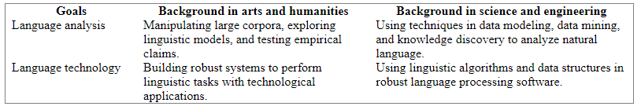

# Introduction

NLP is the computer manipulation of natural language, this could be as simple as counting the word frequencies to compare different writting styles or the complex undertanding of the human utterances.

## What I will learn?

- Simple programs to manipulate and analyze data
- Key concepts of NLP
- NLP Data Structures
- How language data is stored in standard formats and how it can be used to evaluate the performance of NLP techniques
  
  